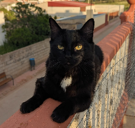

# GeneticArt

This project uses a genetic algorithm to reproduce an image using a set of simple shapes (circles in this case). The algorithm iteratively refines a population of individuals, each representing an image composed of these shapes, to better match a target image.

## Target Image

This is the image the algorithm tries to replicate:



## Evolution

Here is an example of how the generated image evolves over generations.

### Generation 251


### Generation 5001


### Generation 20001


### Generation 44501


## How It Works: The Genetic Algorithm

The core of this project is a genetic algorithm that evolves a population of images to find a close approximation of the target image. Each image is an "individual" defined by its "DNA," which is a sequence of genes. Each gene represents a single colored shape.

The evolution process consists of the following phases in a loop:

### 1. Fitness Evaluation

Each individual in the population is rendered into an image. This generated image is then compared to the target image, pixel by pixel. The "fitness" score is calculated as the sum of the absolute differences between the RGBA (Red, Green, Blue, Alpha) values of each pixel in the generated image and the corresponding pixel in the target image. A lower fitness score means the generated image is a better match for the target.

### 2. Selection

To create the next generation, a "selection" process chooses which individuals get to reproduce. This project uses **Tournament Selection**:

- A small, random subset of individuals (a "tournament") is chosen from the current population.
- The individual with the best fitness score (the lowest) in that tournament is selected as a parent.
- This process is repeated to select a second parent.

Additionally, **Elitism** is used to ensure progress is not lost. A small number of the very best individuals from the current generation are automatically carried over to the next generation without any changes.

### 3. Crossover

Once two parents are selected, they create a "child" individual through **crossover**. A random crossover point is chosen in the DNA sequence of the parents. The child's DNA is created by taking the genes from the first parent up to the crossover point, and the genes from the second parent after that point.

```cpp
// Simplified Crossover Logic
Individual crossover(const Individual& parent1, const Individual& parent2) {
    Individual child;
    size_t crossoverPoint = rand.getInt(0, std::min(parent1.dna.size(), parent2.dna.size()));

    // Copy genes from parent 1
    for (size_t i = 0; i < crossoverPoint; ++i) {
        child.dna.push_back(parent1.dna[i].clone());
    }
    // Copy genes from parent 2
    for (size_t i = crossoverPoint; i < parent2.dna.size(); ++i) {
        child.dna.push_back(parent2.dna[i].clone());
    }
    return child;
}
```

### 4. Mutation

To introduce new variations into the population, the child individuals have a chance to undergo **mutation**. This happens randomly and can take one of three forms:

1.  **Mutate a Gene**: A random gene in the individual's DNA is chosen and one of its properties (position, color, or size/length) is slightly altered.
2.  **Add a Gene**: A completely new, random gene (a new shape) is added to the individual's DNA.
3.  **Delete a Gene**: A random gene is removed from the individual's DNA.

These small, random changes are crucial for exploring new possibilities and preventing the algorithm from getting stuck in a local optimum.

This entire cycle—evaluation, selection, crossover, and mutation—repeats for a set number of generations, with the population (hopefully) getting progressively closer to the target image over time. This is my cat by the way.
